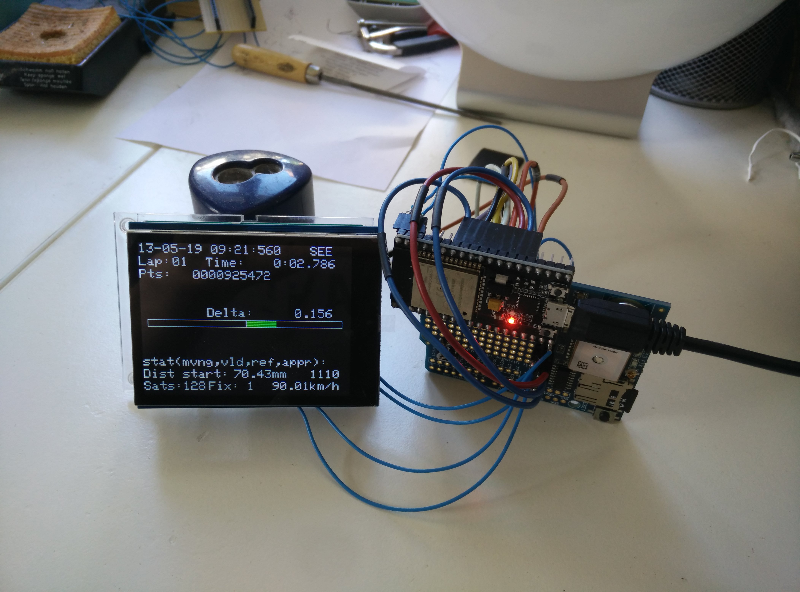

# GPS Tracker and LapTimer

This is a small R&D project intendet to familiarize myself with programming of Mircoprocessors in the Arduino environment.
The goal is to create a GPS tracker and LapTimer that records laps performed at a race track and shows the delta time to the fastest lap.
The code is currently very messy and might get some cleanup at a later point.

A commercial product would be eg [this one](https://www.vboxmotorsport.co.uk/index.php/de/products/performance-meters/vbox-laptimer).

## Parts:
* [NodeMCU-32s](https://hackaday.com/2016/09/15/esp32-hands-on-awesome-promise/)
* Arudino Leonardo
* Adafruit capacitive touchscreen
* [Adafruit ultimate GPS shield with SD interface](https://www.adafruit.com/product/1272)

The GPS module might not be accurate enough to realy calculate accurate delta times, but its cheap and its enough for early testing. Later those modules might be interesting (suggested in [this article](http://grauonline.de/wordpress/?page_id=1468))
http://www.unicorecomm.com/en/product/content_1611.html
https://www.ardusimple.com/product/simplertk2b/

## Setup:
The idea is to split work on two devices:
* ESP32s takes care of the GPS tracking and corresponding calculations as well as handling SD card data
* Leonardo to work the display
The two devices communicate via a very simple binary protocol over Serial port.

### Connections:
* ESP32 -> GPS (Serial)
* ESP32 -> SD (SPI)
* ESP32 -> Leonardo (Serial)
* Leonardo -> Display/Touch (SPI + I2C?)

## Development:
Eclipse IDE, using avrdude_autoreset_wrapper to be able to flash the Leonardo.

### Platforms:
* arduino
* esp32

### Libraries:
* Adafruit FT6206
* Adafruit GFX
* Adafruit GPS
* Adafruit ILI9441
* NeoGPS

(SD library is already included in esp32 platform!)

